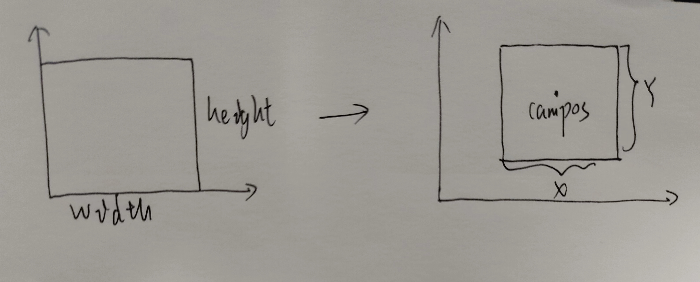
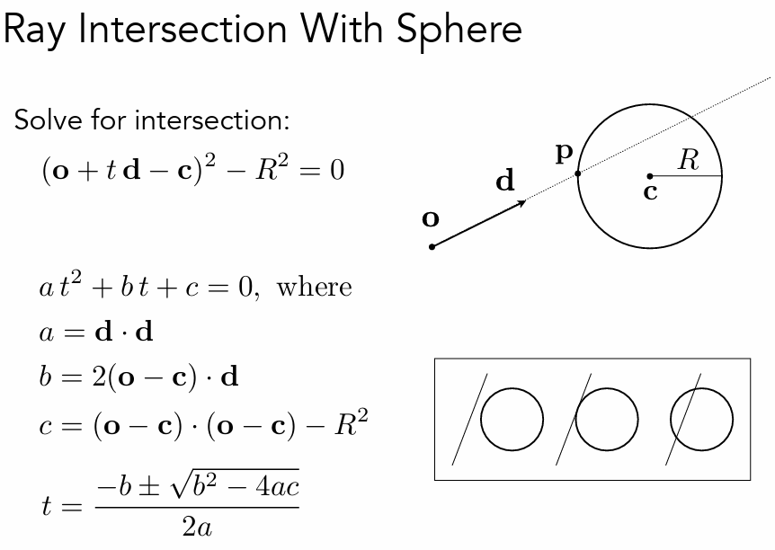
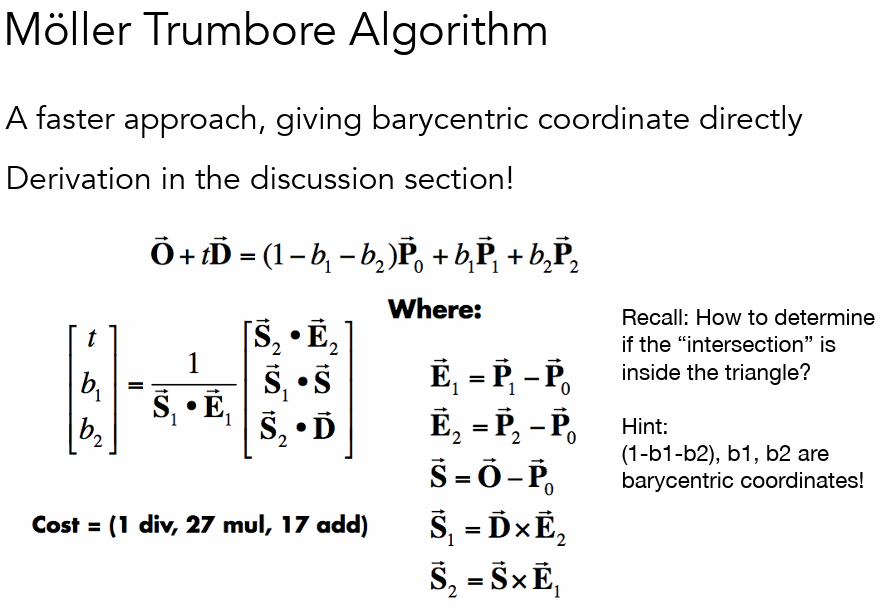
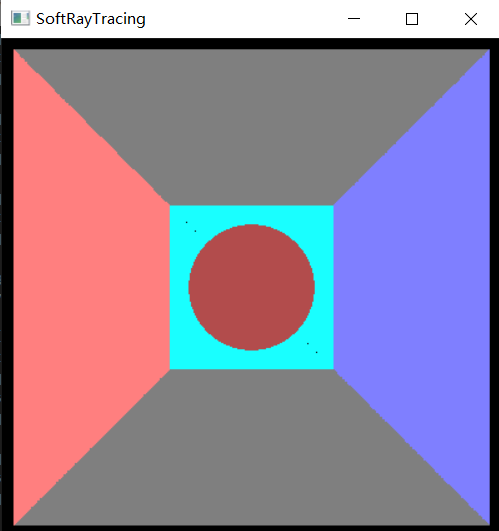

### 一.Screen to Viewport



对于屏幕空间中的像素[i,j],需要映射到世界空间中的顶点才能投射出光线。

定义世界空间中的viewport:

```c++
struct camera
{
    float focal_length;
    vec3f campos;
    float fov;
};
```

上面camera的定义还是简单了一点，毕竟没有考虑方向或者上面默认定义的lookat就是看向-z, up 为+y，right为+x.

根据定义，viewport的x,y为：
$$
y = 2 \times focal\_length \times tan(\frac{fov}{2}) \\
x = \frac{width}{height} \times y
$$
对于屏幕空间中的[i,j]，通过平移 和scale两步可以转换为world space中的坐标，变换矩阵为：
$$
\begin{bmatrix}
\frac{x}{width} & 0 & 0\\
0 & \frac{y}{height} & 0\\
0 & 0 & 1\\
\end{bmatrix}
\times
\begin{bmatrix}
1 & 0 & -\frac{width}{2} + campos.x\\
0 & 1 & -\frac{height}{2} + campos.y\\
0 & 0 & 1\\
\end{bmatrix}
$$

###  二、求交






(图源：games101)

实现求交之后就可以实现直接投射光线的结果了，和光栅化结果相同：




### 三、Ray Tracing

光线追踪的关键：rendering equation
$$
L(p0,wo) = E(p0) + \int_\Omega BRDF(p0,wi,wo)L(p0,wi)cos\theta dw
$$
简单模拟情况下考虑三种材质：

1. diffuse matrial 
2. reflectance 
3. refractance

对于diffuse material来说:
$$
BRDF = \frac{albedo}{\pi}
$$
那么rendering equation为：
$$
L(p0,wo) = \frac{albedo}{\pi}\int_{\Omega}L(p0,wi)cos\theta dw
$$
积分求解自然是通过蒙特卡洛积分，在半球上随机选择一个方向投射出一条光线。
$$
\int f(x)dx = \frac{1}{N}\sum \frac{f(x_i)}{pdf(x_i)}
$$


rendering equation的改进：在半球上采样一条光线打到光源的概率较小，可以直接在光源上面采样，就可以确保光线一定可以打到光源。
$$
L(p0,wo) = \frac{albedo}{\pi}\int_{\Omega}L(p0,wi)cos\theta\frac{dA cos\theta ^{'}}{|x-x'|^2}
$$


对于reflectance model 以及refractance model,可以直接通过反射公式和折射公式计算出光线的方向，自然不需要通过积分的方式求解。

整个过程伪代码如下：

```python
//对一个pixel投射出的radiance 进行shading
vec3 cast_ray(Ray & ray):
    //查找和场景中最近的物体的交点
    HitRes hitpoint = closet_hit(ray)
    if not hit:
        return {0,0,0}
   	else:
		shade(hitpoint,-ray)
```


```python
vec3 shade(hitpoint,Ray & ray):
    if emit:
        return light.color
    else if reflectance:
        compute the reflectance light wi
        HitRes hit = closet_hit(wi)
        return shade(hit,-wi) * albedo
   	else if refractance:
        compute the refractance light wi
        HitRes hit = closet_hit(wi)
        return shade(hit,-wi) * albedo
    else if diffuse:
        sample a light w1 from light
        if blocked:
            l_dir = {0,0,0}
        else :
            l_dir = light.color
        
        random choose a p
        if p > P_RR:
            l_indir = {0,0,0}
        else:
            random choose a light wi
            HitRes hit = closet_hit(wi)
            return shade(hit,-wi) / pdf /pi / P_RR * albedo
```


### 概率论

计算蒙特卡洛积分的时候需要对半球以及light区域进行均匀采样，然后除于pdf，但是一时之间竟然想不明白在半球上以及方形区域上均匀采样的pdf.数学再不用就要忘光光了。首先均匀的随机采样的pdf都是常数，同时在积分域上面积分为1.那么对于半球：
$$
\int_{\Omega}pdfdw = pdf\int_{\Omega}dw = pdf \times 2\pi = 1
$$
在半球上对立体角进行积分就是半球上的立体角的大小，自然就是2pi.

对于正方形区域的light:
$$
\int_{s}pdfdA = pdf\int_{s}dA = pdf * S = 1
$$


### 实现结果

说起来简单，写起来真的折磨啊。。。。。。出问题了只能打印中间结果来看然后对着一个坐标去手算每条光线看看光线对了没有。。。
